---
tags:
  - JS
---

# 浏览器进程

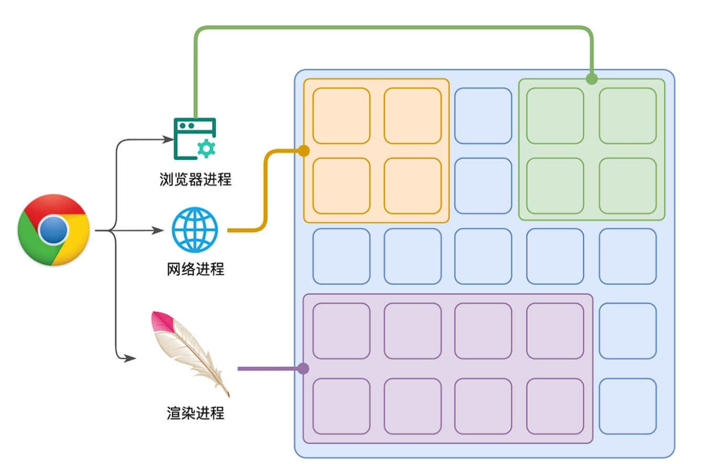

浏览器是一个多进程多线程的应用程序。以 Chrome 浏览器为例，包括1个浏览器主进程，1个GPU进程，1个网络进程，多个渲染进程，和多个插件进程。

- **浏览器进程**：主要负责界面显示、用户交互、子进程管理等。浏览器进程内部会启动多个线程处理不同的任务。

- **网络进程**：负责加载网络资源。网络进程内部会启动多个线程来处理不同的网络任务。

- **渲染进程**：每个标签页通常对应一个独立的渲染进程。渲染进程负责解析、渲染网页并执行 JavaScript 代码。**渲染主线程**是渲染进程中的核心线程，处理 DOM 解析、布局(Layout)、绘制(Painting)以及执行 JavaScript 等主要逻辑。

  > 由于 JavaScript 的执行与网页渲染在同一个主线程中进行，脚本执行会阻塞页面其他操作。


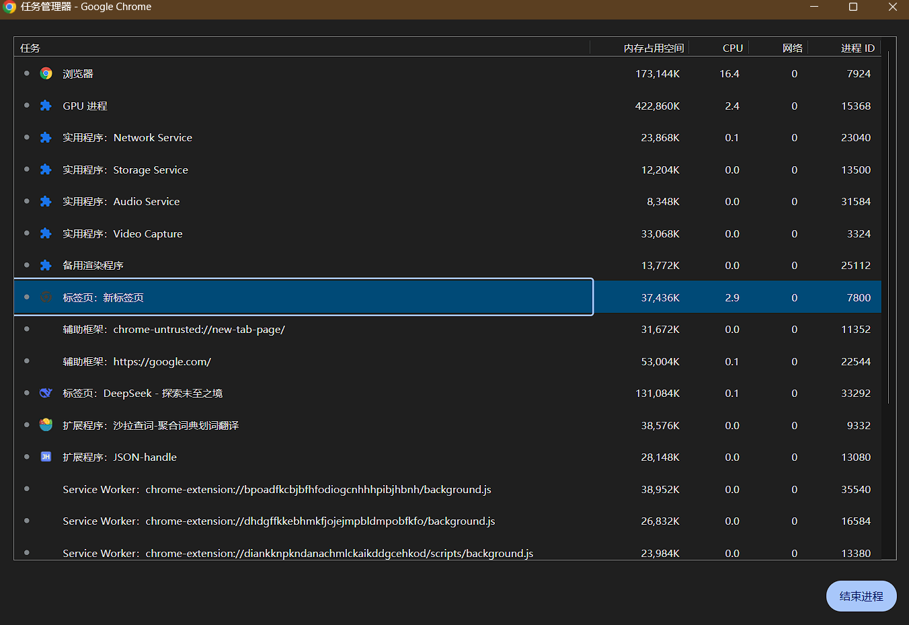

> [!tip] 没有 JS 引擎线程
>
> 以 Chrome  V8 引擎为例，该引擎运行在渲染主线程内，并不额外开辟独立的线程来执行网页中的 JavaScript（即和渲染主线程是同一个线程）。


# 渲染主线程

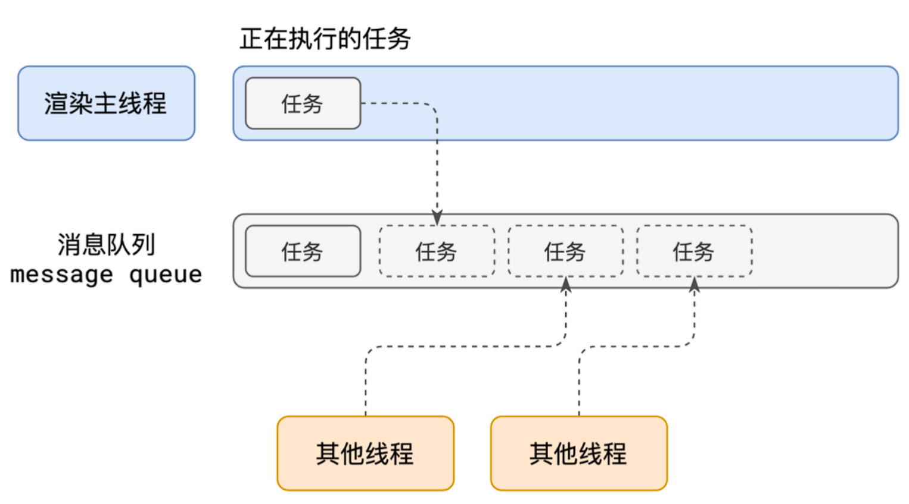

1. 在最开始的时候，渲染主线程会进入一个无限循环。
2. 每一次循环会检查消息队列中是否有任务存在。如果有，就取出第一个任务执行，执行完一个后进入下一次循
   环；如果没有，则进入休眠状态。
3. 其他所有线程（包括其他进程的线程）可以随时向消息队列添加任务。新任务会加到消息队列的末尾。在添加
   新任务时，如果主线程是休眠状态，则会将其唤醒以继续循环拿取任务。

这样一来，就可以让每个任务有条不的、持续的进行下去了。整个过程，被称之为**事件循环（消息循环）**。

> 事件循环 是 W3C标准中的称呼，消息循环 则是谷歌浏览器中的称呼，但他们都是同一个东西。

> [!note] 为什么渲染主线程会进入一个无限循环
>
> [chromium](https://github.com/chromium/chromium) 中渲染主进程的启动函数如下
>
> 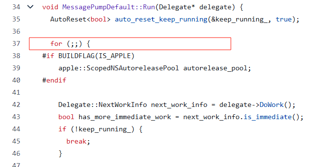
>
> 代码位置：[message_pump_default.cc](https://github.com/chromium/chromium/blob/main/base/message_loop/message_pump_default.cc)

# 为什么需要异步

代码在执行的过程中，会遇到一些无法立即执行的任务，例如 setTimeout、setInterval、Fetch、addEventListener。

如果让渲染主线程等待这些任务的时机达到，就会导致主线程⻓期处于阻塞的状态，从而导致浏览器卡死。

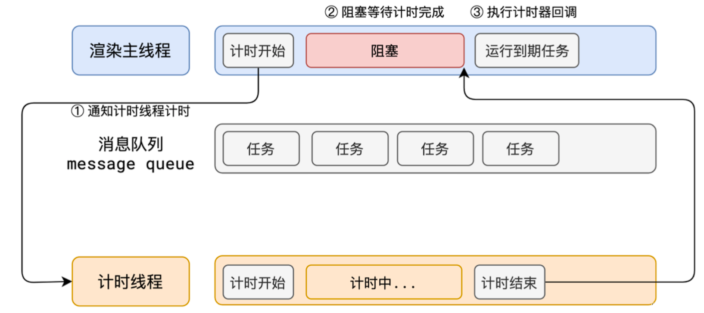

使用异步的方式，渲染主线程将会永不阻塞。

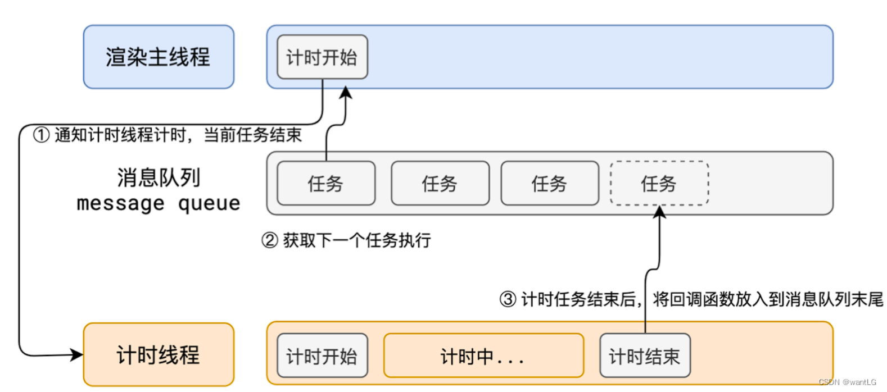

> [!note] 如何理解 JS 的异步?
>
> JS是一⻔单线程的语言，这是**因为它运行在浏览器的渲染主线程中，而渲染主线程只有一个**。而渲染主线程承担着诸多的工作，渲染⻚面、执行 JS 都在其中运行。
>
> 如果使用同步的方式，就极有**可能导致主线程产生阻塞，从而导致消息队列中的很多其他任务无法得到执行**。这样一来，一方面会导致繁忙的主线程白白的消耗时间，另一方面导致⻚面无法及时更新，给用户造成卡死现象。
>
> 所以浏览器**采用异步的方式来避免**。具体做法是当某些任务发生时，比如计时器、网络、事件监听，主线程将任务交给其他线程去处理，自身立即结束任务的执行，转而执行后续代码。**当其他线程完成时，将事先传递的回调函数包装成任务，加入到消息队列的末尾排队，等待主线程调度执行**。在这种异步模式下，浏览器永不阻塞，从而最大限度的保证了单线程的流畅运行。

# JS 阻塞渲染

```html
<h1>A</h1>
<button>change</button>

<script>
  var h1 = document.querySelector('h1')
  var bun = document.querySelector('button')

  function delay(duration){
    var start = Date.now()

    while(Date.now() - start < duration){}
  }

  btn.onclick = function(){
    h1.textContenbt = "B"
    delay(3000)
  }
</script>
```

现象：点击按钮后需要等待3秒才更新h1文本

原因：渲染和js执行都是在渲染主线程里面

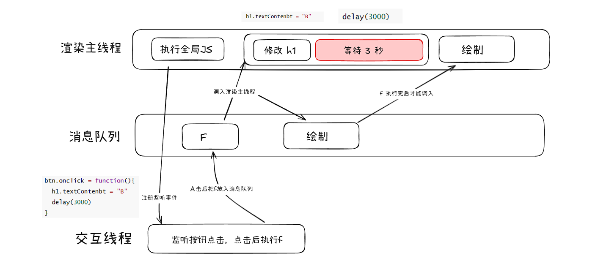

# 队列和优先级

事件循环中不是简单的分为宏队列和微队列。

HTML 规范没有使用“宏任务”这样的术语。规范只是称他们为任务以及微任务，而且每个事件循环有一个或多个任务队列。显然规范并没有把他们统一归类到宏任务队列中。

> 宏任务只是为了区别于微任务。
>
> 但是在 [Nodejs setimmediate](https://nodejs.org/zh-cn/learn/asynchronous-work/understanding-setimmediate) 描述中出现 macrotask queue ？

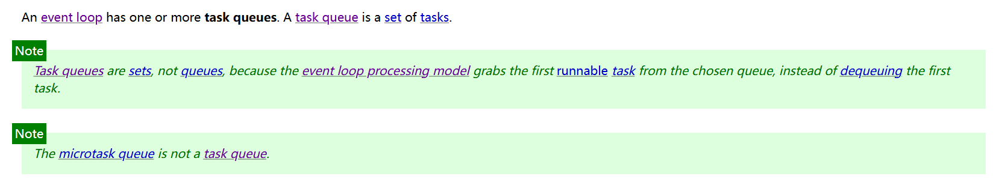

> https://html.spec.whatwg.org/multipage/webappapis.html#event-loop

规范中将任务分为不同的类型，同一个类型的任务必须在一个队列，不同类型的任务可以分属于不同的队列。在一次事件循环中浏览器可以根据实际情况从不同的队列中取出任务执行。

在队列中任务没有优先级，但队列是有优先级的。

> [!note]
>
> 在目前 chrome 的实现中，至少包含了下面的队列：
>
> - 延时队列：用于存放计时器到达后的回调任务，优先级「中」
> - 交互队列：用于存放用户操作后产生的事件处理任务，优先级「高」
> - 微队列：用户存放需要最快执行的任务，优先级「最高」
>
> chrome 浏览器中实现的任务类型 [task_type.h](https://github.com/chromium/chromium/blob/main/third_party/blink/public/platform/task_type.h)

以下面代码为例说明队列是有优先级的

```html
<button id="begin">开始</button>
<button id="interaction">交互</button>
<script>
  var begin = document.getElementById('begin');
  var interaction = document.getElementById('interaction');

  function delay(duration) {
    var start = Date.now();

    while (Date.now() - start < duration) {}
  }

  function A() {
    console.log('添加延时队列');
    setTimeout(() => {
      console.log('延时队列执行');
    }, 100);
    delay(2000);
  }

  function B() {
    console.log('添加交互队列');
    interaction.onclick = () => {
      console.log('交互队列执行');
    };
    delay(2000);
  }

  begin.onclick = () => {
    A();
    B();
    console.log("======")
  };
  // 输出结果：
  // 添加延时队列
  // 添加交互队列
  // ======
  // 交互队列执行
  // 延时队列执行
</script>
```

点击开始按钮后立即点击交互按钮。此时 `console.log('延时队列执行');` 会先添加到延时队列中，`console.log('交互队列执行');` 后添加到交互队列中。

当输出 `======` 时，渲染主线程为空，延时队列和交互队列都有任务等待执行，但此时是先打印 `交互队列执行`，说明任务队列是有优先级的。

---

浏览器必须准备好一个微队列，微队列中的任务优先所有其他任务执行。

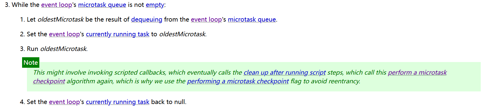

>https://html.spec.whatwg.org/multipage/webappapis.html#perform-a-microtask-checkpoint

将上面的代码案例修改一下

```js
begin.onclick = () => {
  Promise.resolve().then(() => {
    console.log('微任务队列');
  });

  A();
  B();
  console.log("======")
};
// 输出结果：
// 添加延时队列
// 添加交互队列
// ======
// 微任务队列
// 交互队列执行
// 延时队列执行
```


> [!note]  阐述一下JS的事件循环
>
> 事件循环又叫做消息循环，是浏览器渲染主线程的工作方式。
>
> 在 Chrome 的源码中，它开启一个不会结束的 for 循环，每次循环从消息队列中取出第一个任务执行，而其他线程只需要在合适的时候将任务加入到队列末尾即可。
>
> 过去把消息队列简单分为宏队列和微队列，这种说法目前已无法满足复杂的浏览器环境，取而代之的是一种更加灵活多变的处理方式。
>
> 根据 W3C 官方的解释，每个任务有不同的类型，同类型的任务必须在同一个队列，不同的任务可以属于不同的队列。不同任务队列有不同的优先级，在一次事件循环中，由浏览器自行决定取哪一个队列的任务。但浏览器必须有一个微队列，微队列的任务一定具有最高的优先级，必须优先调度执行。

> [!note] JS中的计时器能做到精确计时吗？为什么？
>
> 1. 计算机硬件没有原子钟，**无法做到精确计时**。
> 2. **操作系统的计时函数本身就有少量偏差**，由于JS的计时器最终调用的是操作系统的函数，也就携带了这些偏差。
> 3. 受**事件循环的影响**，计时器的回调函数只能在主线程空闲时运行，因此又带来了偏差。
> 4. 按照W3C的标准，浏览器实现计时器时，如果嵌套层级超过5层，则会**带有4毫秒的最少时间**，这样在计时时间少于4毫秒时又带来了偏差。
>
> 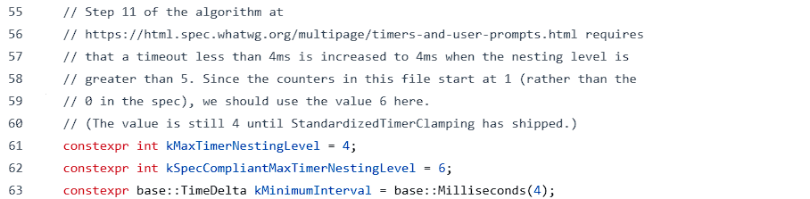
>
> > 源码位置：[dom_timer.cc](https://github.com/chromium/chromium/blob/main/third_party/blink/renderer/core/scheduler/dom_timer.cc#L171)


# 案例

```js
console.log('script start');

async function async1() {
  await async2();
  console.log('async1 end');
}
async function async2() {
  console.log('async2 end');
}
async1();

setTimeout(function () {
  console.log('setTimeout');
}, 0);

new Promise(resolve => {
  console.log('Promise');
  resolve();
})
  .then(function () {
  console.log('promise1');
})
  .then(function () {
  console.log('promise2');
});

console.log('script end');
```

执行顺序：

1. `console.log('script start');`

   这是一条同步任务，直接输出 `script start`。

2. `async1();`

   调用 `async1()` 函数，`async1` 函数会执行。

   在 `async1` 中，`await async2()` 会触发 `async2()` 函数。`async2` 里的 `console.log('async2 end')` 会 **同步** 执行，打印 `async2 end`。然后，`await` 会使得 `async1` 函数在 `async2` 执行完后继续，但此时 `async1` 的剩余部分会被放入**微任务队列** 中，等待当前执行栈为空时执行。

3. `setTimeout(function(){console.log('setTimeout')},0);`

   `setTimeout` 是宏任务，它的回调会被放入**宏任务队列**，并且会等到当前的所有同步代码和微任务都执行完后才会被执行。

4. `new Promise(resolve => {…}).then(…).then(…);`

   在执行 `new Promise()` 的时候，`console.log('Promise')` 是**同步代码**，会立即执行。`resolve()` 会触发 `then()` 中的回调函数，但这些回调会被放入**微任务队列**中，等待当前执行栈中的所有同步代码执行完之后再执行。

5. `console.log('script end');`

   这条语句是同步代码，直接执行，打印 `script end`。

输出顺序：

1. script start
2. async2 end
3. Promise
4. script end
5. async1 end
6. promise1
7. promise2
8. setTimeout

---
```js
async function async1() {
	console.log('1');
	await async2();
	console.log('2');
}

const async2 = async () => {
	await setTimeout(() => {
		Promise.resolve().then(() => {
			console.log('3');
		});
		console.log('4');
	}, 0);
};

const async3 = async () => {
	Promise.resolve().then(() => {
		console.log(6);
	});
};

async1();
console.log(7);
async3();

// 1 7 6 2 4 3
```


# 相关资料

http://latentflip.com/loupe/

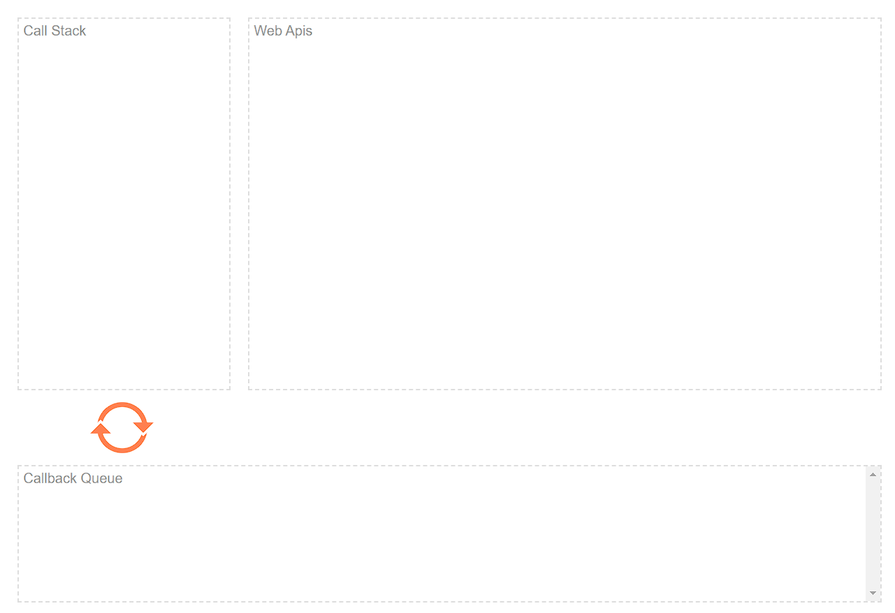

> https://www.youtube.com/watch?v=eiC58R16hb8

<iframe width="1170" height="658"
  src="https://www.youtube.com/embed/eiC58R16hb8"
  frameborder="0"></iframe>


