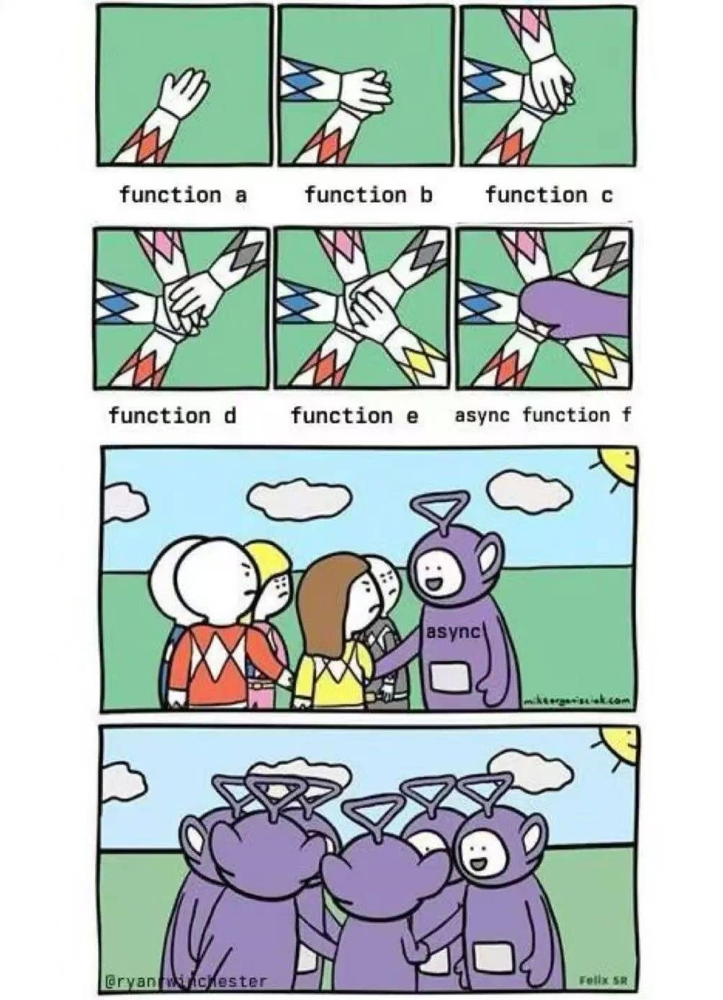

# 异步传染性



由于 fetch 是异步的，导致 f1, f2, f3, main 都变成了异步函数。

```js
async function getUser() {
  return await fetch('...')
}

async function f1(){
  const user = await getUser()
  return user
}

async function f2(){
  const user = await f1()
  return user
}

async function f3(){
  const user = await f2()
  return user
}

async function main(){
  const user = await f3()
  console.log(user)
}
```

# 重写 fetch 

重写 `fetch` 方法并使用缓存，确保请求在函数执行期间只被发起一次，后续请求可以直接使用缓存的结果，避免重复请求相同的资源。

```js
function run(fn){
  // 保存旧的 fetch
  const oldFetch = window.fetch

  // 重写 fetch
  const cache = {
    status: 'pending',
    value: null
  }

  function newFetch(...arguments){
    if(cache.status === 'fulfilled'){
      return cache.value
    }else if(cache.status === 'rejected'){
      throw cache.value
    }
    const promise = oldFetch(...arguments)
      .then(res=>res.json())
      .then(res=>{
        cache.status = 'fulfilled'
        cache.value = res
      })
      .catch(err=>{
        cache.status = 'rejected'
        cache.value = err
      })

    throw promise
  }

  window.fetch = newFetch

  // 运行 fn
  try {
    fn()
  } catch (error) {
    if (error instanceof Promise) {
      error.finally(()=>{
        window.fetch = newFetch
        fn()
        window.fetch = oldFetch
      })
    }
  }

}

run(main)
```

# 生成器函数

利用生成器函数和自动执行器，将异步代码写成同步风格。

```js
function* fetchDataGenerator() {
  const response = yield fetch('https://api.example.com/data');
  const data = yield response.json();
  return data;
}

// 自动执行生成器
function runGenerator(generator) {
  const iterator = generator();

  function handle(iteratorResult) {
    if (iteratorResult.done) return iteratorResult.value;
    const value = iteratorResult.value;
    if (value instanceof Promise) {
      return value.then(res => handle(iterator.next(res)));
    }
  }

  return handle(iterator.next());
}
```


# Node

## 同步库

在 Node 中可以通过阻塞事件循环等待异步操作完成，但这种方式会导致线程阻塞，不适用于浏览器环境。

例如使用 [deasync](https://www.npmjs.com/package/deasync) 库。

```js
const deasync = require('deasync');

function syncFetch(url) {
  let done = false;
  let result, error;
  
  fetch(url)
    .then(res => res.json())
    .then(data => { result = data })
    .catch(err => { error = err })
    .finally(() => { done = true });

  // 阻塞直到异步操作完成
  deasync.loopWhile(() => !done);

  if (error) throw error;
  return result;
}

const data = syncFetch('https://api.example.com/data');
```

## Async Hooks


```js
const async_hooks = require('node:async_hooks');
const fetch = require('node-fetch');

// 用于存储异步上下文信息的 Map
const contexts = new Map();

// 创建一个 AsyncHook 实例，处理生命周期事件
const asyncHook = async_hooks.createHook({
  init(asyncId, type, triggerAsyncId) {
    // 当新的异步资源初始化时，将其上下文信息继承自触发它的异步资源
    if (contexts.has(triggerAsyncId)) {
      contexts.set(asyncId, contexts.get(triggerAsyncId));
    }
  },
  destroy(asyncId) {
    // 当异步资源销毁时，清理上下文信息
    contexts.delete(asyncId);
  }
});

// 启用 AsyncHook
asyncHook.enable();

// 模拟请求处理函数
async function handleRequest(reqId) {
  // 在异步操作开始时，存储请求 ID 到当前异步上下文
  const asyncId = async_hooks.executionAsyncId();
  contexts.set(asyncId, { reqId });

  // 模拟异步 fetch 请求
  try {
    const response = await fetch('https://jsonplaceholder.typicode.com/posts/1');
    const data = await response.json();
    console.log('Fetch Response:', data, 'Context:', getContext());
  } catch (error) {
    console.error('Fetch Error:', error, 'Context:', getContext());
  }
}

// 获取当前异步上下文
function getContext() {
  const asyncId = async_hooks.executionAsyncId();
  return contexts.get(asyncId);
}

// 模拟处理多个请求
handleRequest('req1');
handleRequest('req2');
```

