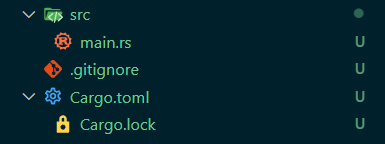
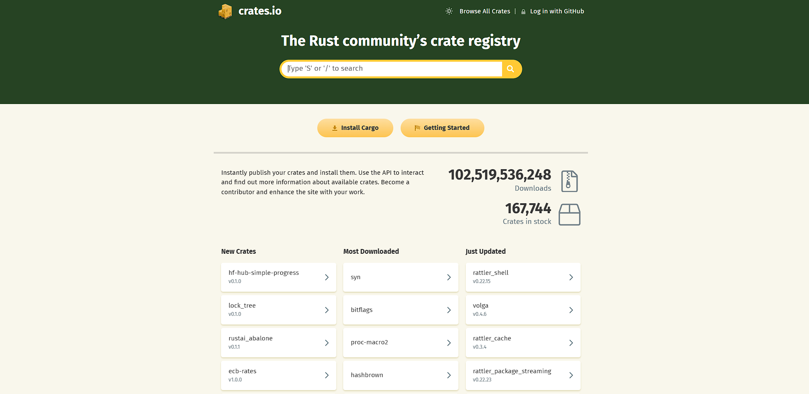

# 新建项目

使 Rust 的包管理器 cargo 新建项目

```
cargo new <项目名>
```


cargo 会为我们生成基本的项目结构和配置文件



# 运行项目

## 手动运行

```(空)
rust main.rs
```

运行后会生成两个文件

- 一个是 exe 文件，包含已编译 Rust 代码的可执行程序文件。
- 一个是 pdb 文件（调试符号文件），包含了程序的调试信息。


## cargo 运行

```
cargo run
```


> 从 cargo run 输出结果可以看出，cargo run 其实运行了两个指令，分别是编译和运行
>
> 

> [!tip]
>
> cargo 默认运行的是 debug 模式，在这个模式下 Rust 编译器不会做太多优化，以便快速编译，牺牲一些运行性能以换取更快的编译速度。
>
> 如果我们想要运行速度更快可以使用发布模式，即在命令后面接上`--release`参数。
>
> ```sh
> cargo run --release
> ```
>
> 在这个模式下 Rust 编译器会应用更多的优化技术，如循环展开、内联函数、去虚拟化等，以提高程序的运行效率。通常会导致编译时间变长，但运行速度更快。

# 配置文件

在使用 Cargo 创建项目时，会生成 `Cargo.toml` 和 `Cargo.lock` 两个重要配置文件。

- `Cargo.toml` 项目配置文件: 允许开发者声明项目所需的依赖和配置，Cargo 会根据这些信息来下载、构建和链接依赖库。
- `Cargo.lock` 依赖锁定文件: 它是一个自动生成的文件，用于锁定项目依赖的确切版本，不需要手动编辑。

```toml title="Cargo.toml"
[package] # 定义了包的名称、版本、作者等信息
name = "rust" 
version = "0.1.0"
edition = "2021"

[dependencies] # 依赖
```

```toml title="Cargo.lock"
# This file is automatically @generated by Cargo.
# It is not intended for manual editing.
version = 3

[[package]]
name = "rust"
version = "0.1.0"
```

# 修改镜像

在`$HOME/.cargo`下新建`config.toml`

```toml title="config.toml"
# 选择的镜像源
# 喜欢哪个用哪个吧，没有注释掉的那个就是你选择的
#replace-with = 'ustc'
#replace-with = 'tuna'
#replace-with = 'sjtu'
#replace-with = 'rustcc'
replace-with = 'aliyun'

# 源码地址
[source.crates-io]
registry = "https://github.com/rust-lang/crates.io-index"

# 镜像地址

# 清华大学
[source.tuna]
registry = "https://mirrors.tuna.tsinghua.edu.cn/git/crates.io-index.git"

# 中国科学技术大学
[source.ustc]
registry = "git://mirrors.ustc.edu.cn/crates.io-index"

# 上海交通大学
[source.sjtu]
registry = "https://mirrors.sjtug.sjtu.edu.cn/git/crates.io-index"

# rustcc社区
[source.rustcc]
registry = "git://crates.rustcc.cn/crates.io-index"

# 阿里云
[source.aliyun]
registry = "https://code.aliyun.com/rustcc/crates.io-index"
```

# 安装依赖

在 https://crates.io/ 中可以查找各种 Rust 依赖，作用类似于 NPM。



从依赖的介绍页面可以知道，依赖安装有自动安装和手动安装两种方式。


